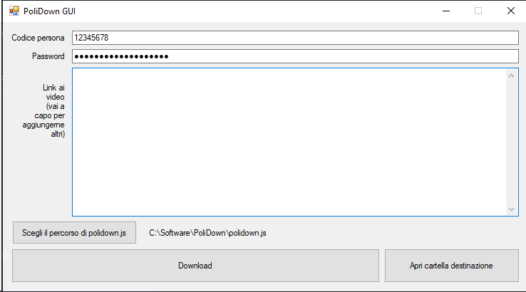

# 👇 Warning 👇

Questo progetto è **deprecato**.

Visitate quello nuovo qui:
https://polinetwork.github.io/it/projects/polidl/index.html

# 👆 Warning 👆

## PoliDownGUI

Il software è disponibile solo per Windows (7 o superiore)

Questo software è solo un'interfaccia grafica ad un software già esistente non in nostra gestione
https://github.com/sup3rgiu/PoliDown

Si presume quindi che abbiate già installato il software (seguendo il tutorial https://www.youtube.com/watch?v=iZgea4t5YW4)

Una volta che avrete installato il software di sup3rgiu potrete usare il nostro, scaricando il file .exe dalla pagina releases
https://github.com/PoliNetwork/PoliDownGUI/releases

Se volete contattarci, visitate il nostro sito https://polinetwork.github.io per i contatti
